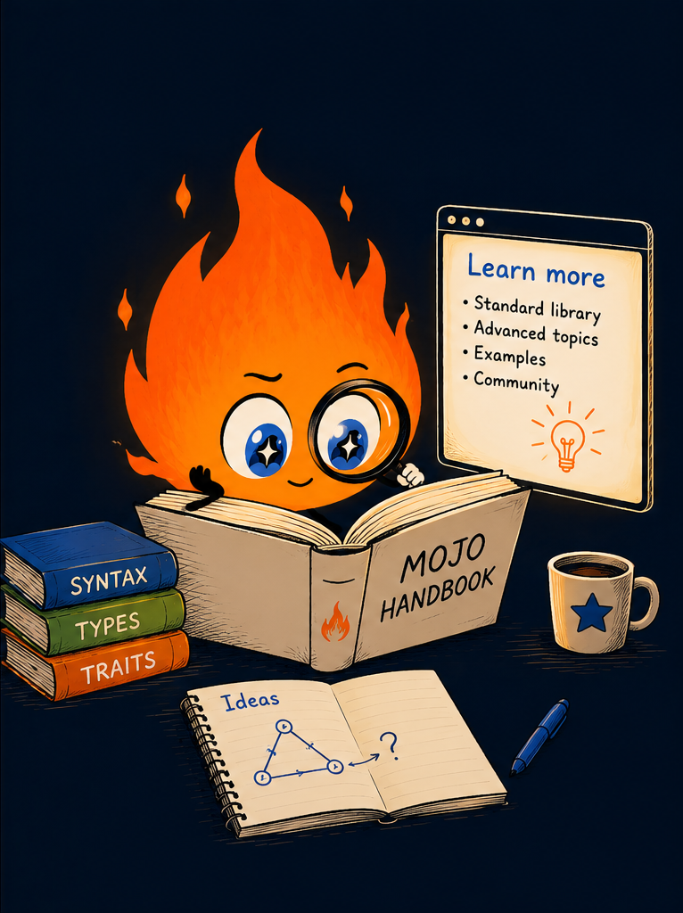

# Learn more

There's so much more to learn and explore in Mojo.
Here are links to explore what's next:

- 🔥 Visit our **Mojo language manual**. 
  &nbsp;&nbsp;&nbsp;&nbsp;&nbsp;&nbsp;&nbsp;&nbsp;
  [Resource for
  learning](https://mojolang.org/nightly/docs/manual/)

- 🔥 In **Mojo Quest**, you'll learn Mojo by solving code
  problems right in the browser. 
  &nbsp;&nbsp;&nbsp;&nbsp;&nbsp;&nbsp;&nbsp;&nbsp;
  [Get started](https://quest.mojolang.org)

- 🔥 Check out our **Mojo cheat sheets**. Each preview matches
  your light or dark theme. Click a preview to open it full size,
  or download a PNG or PDF to keep. 
  &nbsp;&nbsp;&nbsp;&nbsp;&nbsp;&nbsp;&nbsp;&nbsp;
  [Take a
  look](https://mojolang.org/nightly/docs/reference/cheat-sheets/)

  
  

> [!NOTE]
> Advent of Mojo is a work in progress. Content, examples, and structure
> may change. If you've found a bug, have a suggestion, or want to flag
> something confusing, or any other reason, please open a thorough
> ***Documentation*** issue on the
> [Modular GitHub](https://github.com/modular/modular/issues).
>
> This link may change when Advent is broken off to its own repository.
