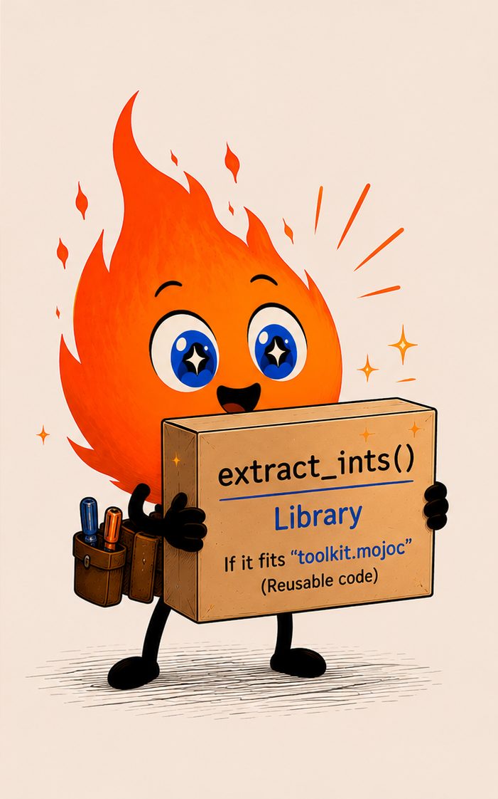
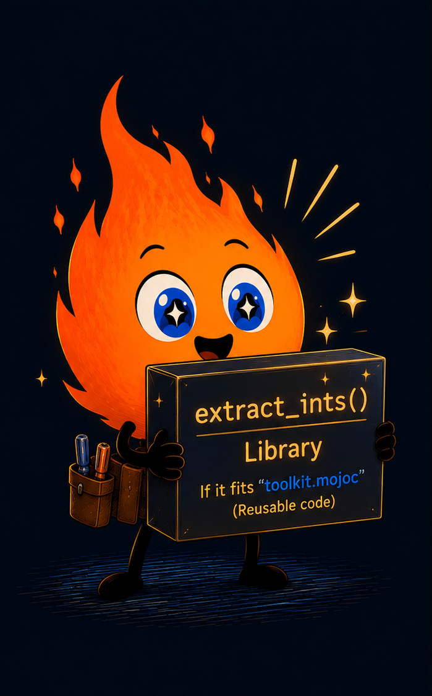

# Reuse your code 🔥

<!-- markdownlint-disable MD024 -->

<div class="intro">
  <div class="intro-text">

Many puzzles follow the same pattern to pull the numbers and clean them up in
order to formulate a solution. Consolidating these into reusable libraries
means you only need to solve your problems once.

> [!NOTE]
> Advent of Mojo is a work in progress. Content, examples, and structure
> may change. If you've found a bug, have a suggestion, or want to flag
> something confusing, or any other reason, please open a thorough
> ***Documentation*** issue on the
> [Modular GitHub](https://github.com/modular/modular/issues).
>
> This link may change when Advent is broken off to its own repository.

  </div>

  <div class="intro-image">
    
    
  </div>
</div>

## The moves you keep repeating

By now you've pulled integers from text, corrected readings, and averaged
them. You wrote each move inline. A function gives the move a name and a
home, letting the next puzzle reuse it instead of retyping it.

### Build a library

Create a folder called `toolkit/`.

In that folder, create `__init__.mojo` and add extractor. There's no
`main()` function, just the one `extract_ints()` function:

```mojo
{{#include ../snippets/reuse_your_code/toolkit/__init__.mojo:extract_ints}}
```

Compile it with `precompile`. This builds toolkit.mojoc:

```bash
mojo precompile toolkit.mojo
```

### Link a library

Now create `test.mojo` in your main folder, not inside `toolkit`:

```bash
from toolkit import extract_ints

def main():
    var s = "a 1 b 2 c 3"
    try:
        var list = extract_ints(s)
        print(list)
    except e:
        print(e)
```

Compile and run test.mojo:

```bash
mojo test.mojo toolkit.mojoc
```

Your app prints `[1, 2, 3]` using the function from your library.

### Checkpoint

- A library lets you write once and use often.
- The declarations in the library are your API contract. `extract_ints`
  promises a `List[Int]` and hands ownership out with `^`.
- The same tool now works on input you've never seen.

## Default arguments

A parameter can carry a default, so callers skip it in the common case and
override it when they need to. Station 3 reads high when the sun hits it
midday, so correct readings taken in those hours. Add to your library:

```mojo
{{#include ../snippets/reuse_your_code/toolkit/__init__.mojo:corrected}}
```

Call it from `main()` with the default, or name the argument to override it:

```mojo
{{#include ../snippets/reuse_your_code/reuse_your_code.mojo:call_corrected}}
```

### Checkpoint

- `offset: Float64 = 1.5` gives the parameter a default. Callers that omit
  supplying their own `offset` use this as their offset value.
- Name an argument at the call site (`offset=2.0`) to set it explicitly and
  skip the guesswork about argument order.
- A default keeps the common call short.

## Compose functions

Small functions snap together. Add one that averages a list, then run readings
through correction and into the average. In the library:

```mojo
{{#include ../snippets/reuse_your_code/toolkit/__init__.mojo:mean_of}}
```

In `main()`, correct each reading, then summarize the corrected set:

```mojo
{{#include ../snippets/reuse_your_code/reuse_your_code.mojo:compose}}
```

### Checkpoint

- Each function does one thing, so they read as a pipeline: parse, correct,
  summarize.
- `corrected` runs per reading; `mean_of` runs over the whole list. Small
  pieces, combined at the call site.

## Final code

Your complete `toolkit/__init__.mojo`:

```mojo
{{#include ../snippets/reuse_your_code/toolkit/__init__.mojo:full}}
```

and:

```mojo
{{#include ../snippets/reuse_your_code/reuse_your_code.mojo:full}}
```

## Topics covered

Building a library and linking it, naming a move as a function, return-type
contracts, returning a `List` with `^`, default arguments, keyword
arguments at the call site, and composing small functions into a pipeline.

<!-- markdownlint-enable MD024 -->

> **Code reuse**
> <center>
> <div class="outro-image">
>  class="outro-image-light"
> src="img/code-reuse.png"
> alt="Development realities. Three versions of the same code."
>    >
>  class="outro-image-dark"
> src="img/code-reuse.png"
> alt="Development realities. Three versions of the same code."
>    >
> </div>
> </center>
> &nbsp;
>
