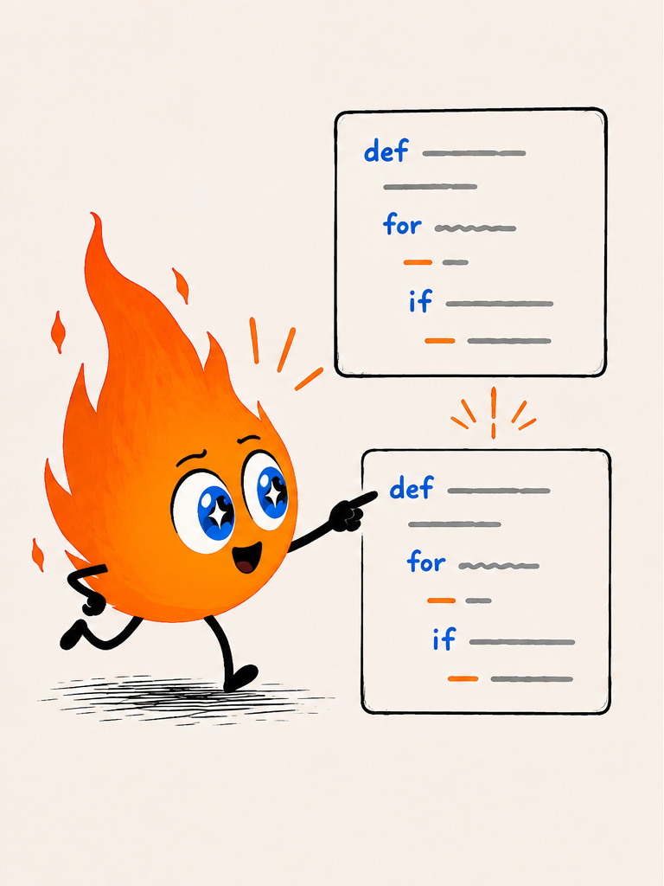
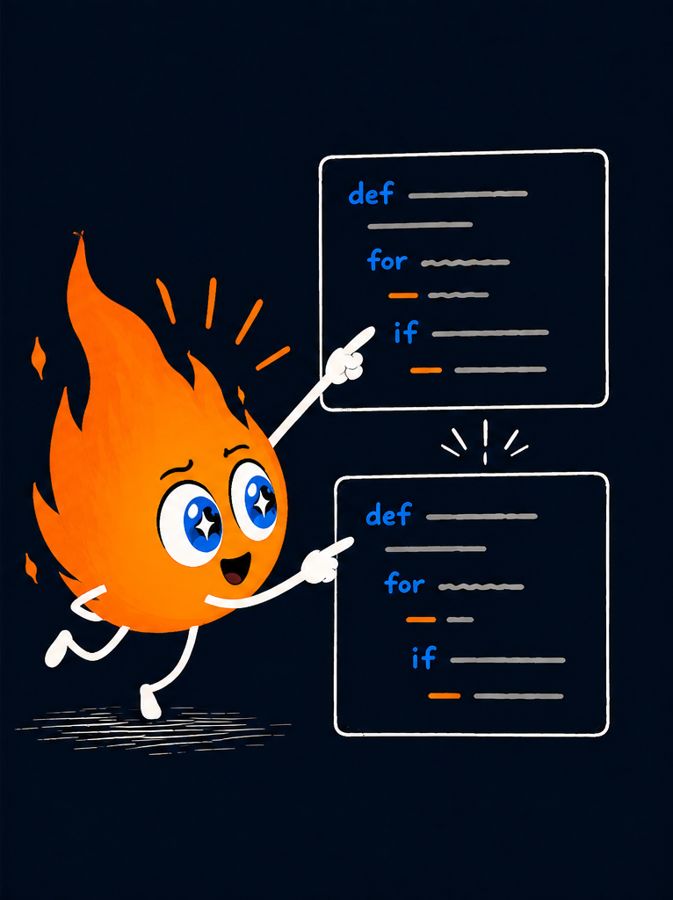

# Welcome to Advent of Mojo 🔥

  

Welcome! We're excited to explore Mojo with you. You may be discovering
Mojo for the first time. You may be evaluating it for your next project.
Either way, the fastest way to get to know a language is to use it.

Let's write some Mojo together.

- Not by reading a language specification.
- Not by memorizing every feature.
- Not by studying type theory before writing code.

Instead, you'll write real code, solve real problems, and learn Mojo by
using it.

  

  

    
    
  

## About you

If you're looking at this page, we're guessing you already know how to
program.

You may come from Python, Swift, Rust, C++, JavaScript, Go, Java, or
another language entirely. You already understand variables, loops,
functions, and data structures. You don't need another introduction to
programming.

What you need is a working Mojo vocabulary.

## What you'll see

This workbook combines short explanations, runnable examples, experiments,
and exercises that help you learn by doing.

You'll see some sharp edges along the way. When something matters, we'll
call it out directly.

We won't cover every language feature, and we won't spend much time on
Mojo's design philosophy. Our goal is simpler: get Mojo under your
fingertips.

> [!NOTE]
> Advent of Mojo is a work in progress. Content, examples, and structure
> may change. If you've found a bug, have a suggestion, or want to flag
> something confusing, or any other reason, please open a thorough
> ***Documentation*** issue on the
> [Modular GitHub](https://github.com/modular/modular/issues).
>
> This link may change when Advent is broken off to its own repository.
