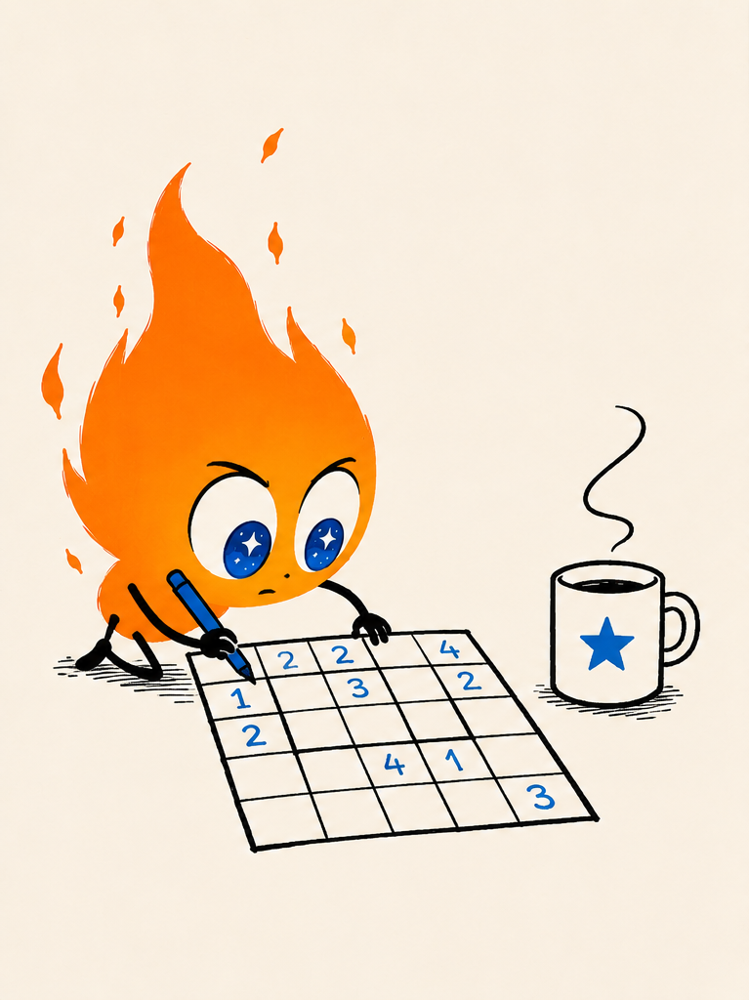
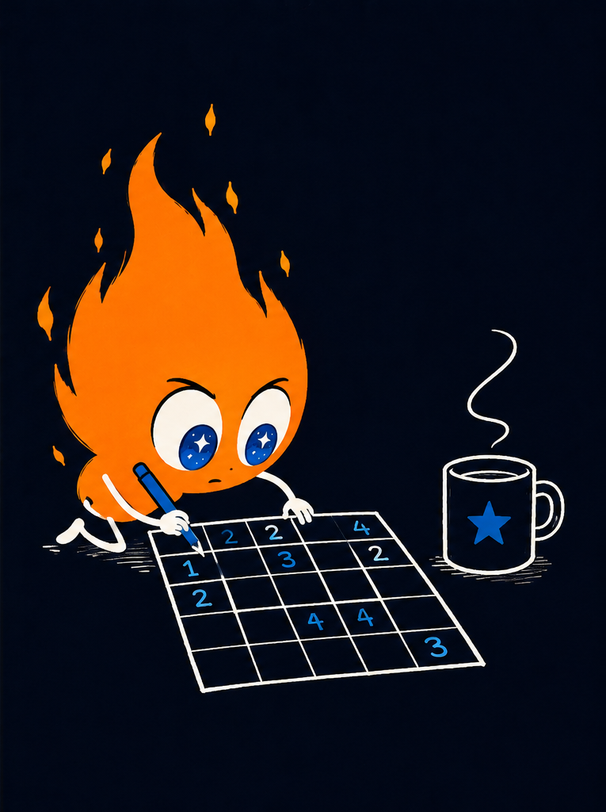

# Work with grids 🔥

<div class="intro">
  <div class="intro-text">

Dr. Green grows fresh vegetables for the entire North Pole in a cozy
greenhouse tucked behind the workshop. Unfortunately, a few warming pads
have quietly failed, and the lettuce has started filing formal complaints.
It's time to find the cold spots before dinner becomes very crunchy and the
iceberg lettuce lives up to its name.

Fortunately, every square in the garden has a temperature sensor.

Your puzzle gives you the temperature readings as a grid. Your job is to
find the cool spots by comparing each sensor with its neighbors.

Along the way you'll learn how to represent a grid, convert between
coordinates and array indices, walk neighboring cells, and visualize
your results.

  </div>

  <div class="intro-image">
    
    
  </div>
</div>

> [!NOTE]
> Advent of Mojo is a work in progress. Content, examples, and structure
> may change. If you've found a bug, have a suggestion, or want to flag
> something confusing, or any other reason, please open a thorough
> ***Documentation*** issue on the
> [Modular GitHub](https://github.com/modular/modular/issues).
>
> This link may change when Advent is broken off to its own repository.

<!-- markdownlint-disable MD024 -->

## Today's data

Until now, you've mostly worked with strings and lists. Many Advent
puzzles instead describe a two-dimensional world: a map, maze, image,
game board, or sensor grid.

Although the data is conceptually two-dimensional, it's usually easiest to
store it as a single list. You recover rows and columns with a little
arithmetic.

### The data

Download [grid_temps.txt](./downloads/grid_temps.txt). Each line packs seven
readings together: every two digits is one sensor's temperature, always
below zero, with a magnitude between 00 and 40:

```text
30252832201503
22180520151011
27203022171819
19033231161011
24302230190908
```

The first row's pairs, `30 25 28 32 20 15 03`, become the readings `-30,
-25, -28, -32, -20, -15, -3`.

### Create the project file

Create `work_with_grids.mojo`, and unpack the digit pairs into a flat,
row-major list of temperatures:

```mojo
{{#include ../snippets/work_with_grids/work_with_grids.mojo:data_setup}}
```

The list contains five rows of seven readings each.

> **Detective Mojo**
> <center>
> <div class="outro-image">
>  class="outro-image-light"
> src="img/plant-grow-light.png"
> alt="On the hunt for an answer to the sensor issues."
>    >
>  class="outro-image-dark"
> src="img/plant-grow-dark.png"
> alt="On the hunt for an answer to the sensor issues."
>    >
> </div>
> </center>
> &nbsp;
>

## Convert between indices and coordinates

The readings live in a single list, but puzzles think in rows and
columns. You'll constantly move between the two representations.

Add these helper functions in `main()` as nested items:

```mojo
{{#include ../snippets/work_with_grids/work_with_grids.mojo:helpers}}
```

The first converts a list index into (row, col). The second converts a
row and column back into a list index to retrieve the value.

### Checkpoint

- `{imm}` gives the nested functions read-only access to values defined in
  `main()`. Here it captures `cols` and `data` as immutable references.
- The data stays in one linear list using row-major ordering.
- Division finds the row. Modulo finds the column.
- Looking up a coordinate computes an index instead of copying data.
- Returning coordinates as a tuple lets you unpack them naturally.

## Print the grid

Before solving the puzzle, it's helpful to see the data laid out as a
grid. Add a place to remember which cells turn out to be cool spots:

```mojo
{{#include ../snippets/work_with_grids/work_with_grids.mojo:cool_indices}}
```

Add a `write_data()` helper that loops over each row and column, formats
the values into aligned columns with `ascii_rjust()`, and marks any
coordinate already in `cool_indices` with `*`:

```mojo
{{#include ../snippets/work_with_grids/work_with_grids.mojo:write_data}}
```

Call it once to check the raw grid, before you've searched for anything:

```mojo
{{#include ../snippets/work_with_grids/work_with_grids.mojo:initial_print}}
```

Since `cool_indices` starts out empty, nothing gets marked yet.

### Checkpoint

- `ascii_rjust()` right-aligns values into fixed-width columns.
- Adjust `print_width` if your values become wider.
- Nested loops naturally walk rows and columns.
- The same `write_data()` you just wrote will show your results later.
  Calling it again after the search populates `cool_indices` is the only
  thing that changes.

## Compare neighboring cells

A single reading doesn't tell you much. Is -30 cold? Compared to what?
Is that a cool spot? How do you know? Do you pick a cut-off number?

The interesting part is how each reading compares with the temperatures
around it. For this puzzle, a point is considered a **cool spot** if most
of its neighbors are warmer. Remember that with negative readings,
warmer means closer to zero, so a plain `>` comparison still works.

### Clarifying the search

You'll need to define some puzzle parameters to limit your search and
produce your results.

```mojo
{{#include ../snippets/work_with_grids/work_with_grids.mojo:search_params}}
```

A radius of one creates a 3×3 neighborhood. Excluding the center leaves
eight neighboring cells.

### Performing the search

Here's the heart of your project. For each location, you examine the
square neighborhood centered on that spot. Every warmer neighbor
increments `cooler`. If more than half the neighbors are warmer, you've
found a cool spot.

```mojo
{{#include ../snippets/work_with_grids/work_with_grids.mojo:search_loop}}
```

The boundary check uses chained comparisons to make sure that at the
current spot, there are at least radius values in each direction. This
makes sure indexes in the following loop are safe.

Chained comparisons split pairwise: `x < y <= z` is equivalent to
`x < y and y <= z`. They're a compact Mojo way to express related
checks.

Append the `(row, col)` tuple to `cool_indices` once you've confirmed a
cool spot:

```mojo
{{#include ../snippets/work_with_grids/work_with_grids.mojo:mark_cool}}
```

When you run the search, you'll find five cool spots: `(2, 2)`, `(2, 3)`,
`(2, 5)`, `(3, 2)`, and `(3, 3)`.

### Checkpoint

- The outer loop visits every cell.
- The inner loops visit each neighboring location.
- The current cell is skipped.
- `cooler` counts warmer neighbors for one location.

## Visualize the answer

Finding the answer is good.

Seeing it is even better.

Call `write_data()` one more time, now that the search has filled in
`cool_indices`:

```mojo
{{#include ../snippets/work_with_grids/work_with_grids.mojo:final_call}}
```

### Checkpoint

- Store interesting coordinates separately instead of modifying the
  data.
- The same display routine works before and after the search.
- Simple visualization is an effective debugging tool.

## Run the app

The highlighted grid makes it clear where the colder regions are:

```text
 -30  -25  -28  -32  -20  -15   -3
 -22  -18   -5  -20  -15  -10  -11
 -27  -20  -30* -22* -17  -18* -19
 -19   -3  -32* -31* -16  -10  -11
 -24  -30  -22  -30  -19   -9   -8
```

The failed warming pad is immediately obvious.

> **Good work**
> <center>
> <div class="outro-image">
>  class="outro-image-light"
> src="img/sensorbration-light.png"
> alt="Mojo awards a blue ribbon to consistent sensor #7"
>    >
>  class="outro-image-dark"
> src="img/sensorbration-dark.png"
> alt="Mojo awards a blue ribbon to consistent sensor #7"
>    >
> </div>
> </center>
> &nbsp;
>

## Final code

Your complete `work_with_grids.mojo`:

<!-- markdownlint-disable MD013 -->

```mojo
{{#include ../snippets/work_with_grids/work_with_grids.mojo:final}}
```

<!-- markdownlint-enable MD013 -->

## Topics covered

Representing a grid in a linear array, row-major indexing, tuple
unpacking, nested loops, coordinate arithmetic, chained comparisons,
neighborhood searches, simple visualization, and one of the most common
patterns in Advent of Code.

> **Finding broken sensors**
> <center>
> <div class="outro-image">
>  class="outro-image-light"
> src="img/sensor-light.png"
> alt="Mojo finds the problem by checking the sensors"
>    >
>  class="outro-image-dark"
> src="img/sensor-dark.png"
> alt="Mojo finds the problem by checking the sensors"
>    >
> </div>
> </center>
> &nbsp;
>

<!-- markdownlint-enable MD024 -->
